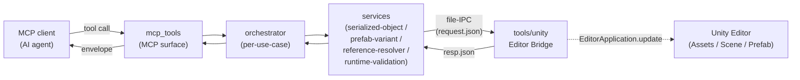

# Architecture

Prefab Sentinel の構成概観・レイヤ責務・サービス仕様・データモデル・用語集の正本。運用ルールの正本は [AGENTS.md](./AGENTS.md)。本ファイルは「どこに何があるか」のオリエンテーションと、各レイヤ・サービスの責務境界を担う。

## 概要

MCP クライアントから入った 1 リクエストは、`mcp_tools` で受信され、`orchestrator` がユースケース単位に各 `services` を順序付き編成し、書き込み・実行検証は `tools/unity` の常駐 Editor Bridge へ file-IPC で中継される。Bridge は Unity Editor 内で操作を実行し、`success / severity / code / message / data / diagnostics` エンベロープを応答として返す。

データフロー原則:

- 読み取りは「構造化」優先、文字列処理は補助。
- 書き込みは「意図（path + value）」で実行する。
- 全更新に `before/after` 差分と検証結果を付帯する。

## レイヤ責務

各レイヤは単一責務を持ち、入出力は隣接レイヤとの境界でだけ正規化される。書き込みは必ず `confirm=True` + `change_reason` を要求し、未配線・必須参照欠落は `error` で fail-fast する。冗長化のためのフォールバック実装（自動探索・代替経路）は持たない。

### services

`prefab_sentinel/services/` 配下の 4 サブパッケージ。`serialized-object` は SerializedProperty 経由の値読み書き、`prefab-variant` は Base / Variant / Scene 横断の override 可視化、`reference-resolver` は GUID / fileID の逆引きと missing 検出、`runtime-validation` は UdonSharp compile + ClientSim の実行検証を担う。各サービスは public API を 1 クラス（例: `SerializedObjectService`）に絞り、再 export やシムは置かない。詳細仕様は [サービス仕様（詳細）](#サービス仕様詳細) を参照。

### orchestrator

`prefab_sentinel.orchestrator*` モジュール群。`inspect_wiring` / `inspect_variant` / `validate_refs` / `patch_apply` / `delete_assets` などのユースケース単位で複数 service を編成し、実行計画と停止条件を管理する。応答は常に `ToolResponse.to_dict()` 経由で `success / severity / code / message / data / diagnostics` エンベロープに正規化する。`critical` / `error` が 1 件でも生じれば後続を停止する fail-fast 原則。`delete_assets` は dry-run 計画を返し、confirmed apply では Editor Bridge の AssetDatabase action に委譲して削除後の broken-reference delta を返す。`orchestrator_postcondition` と `orchestrator_validation` は mutation testing の P0 監査対象（[TESTING.md の Mutation testing 節](./TESTING.md#mutation-testing)）。

### mcp_tools

`prefab_sentinel/mcp_*` モジュール群と `prefab-sentinel-mcp` エントリポイント。orchestrator と symbol-tree を MCP ツールとして公開する薄いラッパー層で、引数バリデーションと pre-bridge reject（`CHANGE_REASON_REQUIRED`、`COMPILE_TIMEOUT_OUT_OF_RANGE` など）を担う。参照系ツール（`get_unity_symbols` / `find_unity_symbol` / `find_referencing_assets`）はペイロードを直接返し、操作系・検証系・orchestrator 系は標準エンベロープを返す（[docs/api-reference.md「レスポンスフォーマット」](./docs/api-reference.md#レスポンスフォーマット)）。

### tools/unity

`tools/unity_patch_bridge.py`（Python 側中継）と `tools/unity/PrefabSentinel.*.cs`（Unity Editor 内 C# 実装）の対で構成する常駐 Editor Bridge。`UNITYTOOL_BRIDGE_WATCH_DIR` 配下に `{uuid}.request.json` を書き込み、`{uuid}.response.json` の出現をポーリングする file-IPC のみが Unity との連携経路（issue #270 で Unity batchmode 経路は削除済み）。C# 側は `EditorApplication.update` で 500 ms 間隔のディスパッチを行い、`UnityEditorControlBridge` と `UnityPatchBridge` をそれぞれ概念単位の partial class に分割している（partial inventory は AGENTS.md「設計原則」を参照）。Project asset の確定削除は `UnityEditorControlBridge.AssetDelete` partial が `AssetDatabase.DeleteAssets` で実行し、Python filesystem delete は使用しない。

### skills

`skills/` 配下の運用プロトコル。`guide` / `variant-safe-edit` / `prefab-reference-repair` / `udon-log-triage` / `knowledge-acquisition` の 5 つで、各 `SKILL.md` にツール呼び出し順と停止条件を記述する。Claude Code / Codex CLI に Plugin として導入された場合は `/prefab-sentinel:<skill>` で呼び出す（[README.md のセットアップ節](./README.md#セットアップ)参照）。

## サービス仕様（詳細）

`prefab_sentinel/services/` 配下の 4 サービスの責務・主機能 API・検証規約。レイヤ全体での位置づけは [レイヤ責務](#レイヤ責務) と [責務境界マトリクス](#責務境界マトリクス) を参照。

#### serialized-object

**目的** — Unity の SerializedObject / SerializedProperty 経由で安全に値を読む・書く。

**主機能** — `get_object(path_or_guid, component_type, object_name?)` / `get_property(object_handle, property_path)` / `set_property(object_handle, property_path, value)` / `insert_array_element(object_handle, property_path, index, value)` / `remove_array_element(object_handle, property_path, index)` / `apply_and_save(target_asset_or_scene)` / `dry_run_patch(ops[])`。

**検証規約** — 型一致必須。`UnityEngine.Object` 参照は存在確認必須。必須参照欠落は `error` で停止する（fail-fast）。

#### prefab-variant

**目的** — Base / Variant / Scene インスタンスを横断して実効値と override を可視化する。

**主機能** — `resolve_prefab_chain(variant_path)` / `list_overrides(variant_path)` / `compute_effective_values(variant_path, component_filter?)` / `detect_stale_overrides(variant_path)` / `migrate_override_paths(variant_path, mapping_rules)` / `remove_orphan_overrides(variant_path)`。

**重点検査** — 存在しない `propertyPath`、型変更後に残った古い override、`Array.size` と `Array.data[i]` の整合、重複 override・後勝ち衝突。

**失敗時挙動** — 自動修復不可の場合は `decision_required`、自動修復対象は `safe_fix` として提案と根拠を返却する。

**`list_overrides` レスポンス形状（issue #172）** — `data.overrides[]` の各エントリは次の 8 キーを必ず持つ:

| キー | 値 |
|---|---|
| `kind` | 4 値の判別文字列 (`array_size` / `array_data` / `object_reference` / `value`) |
| `target_key` | `<guid>:<fileID>` 複合識別子 |
| `line` | YAML 中の `- target:` 行番号（1 始まり） |
| `target_file_id` | override 対象の fileID 文字列 |
| `target_guid` | override 対象の正規化済み GUID |
| `property_path` | Unity の SerializedProperty パス |
| `value` | 平文 value フィールド |
| `object_reference` | objectReference フィールド (`{fileID: 0}` を含む) |

`kind` の決定規則: `array_size` は `property_path` が `*.Array.size` に一致するとき、`array_data` は `*.Array.data[<index>]` に一致するとき、`object_reference` は `object_reference` が空でも `{fileID: 0}` でもないとき、`value` はそれ以外（`object_reference` が空または `{fileID: 0}`、もしくは `objectReference` フィールドが無いケースを含む）。`target_key` は `target_guid` と `target_file_id` の `<guid>:<fileID>` 連結文字列で、下流コンシューマは個別フィールドを再連結せず `target_key` を識別子として使う。

#### reference-resolver

**目的** — GUID / fileID 参照を人間可読の実体へ逆引きし、壊れた参照を早期検出する。

**主機能** — `resolve_reference(guid, file_id)` / `resolve_object_to_reference(asset_path, hierarchy_path, component_type)` / `scan_broken_references(scope, *, top_missing_breakdown=False)` / `where_used(asset_or_guid)` / `validate_pointer_set(pointer_list)`。`top_missing_breakdown=True` で `top_missing_asset_guids[].referenced_from` に `{source, count}` の per-source-file 内訳が追加される（issue #198）。`where_used` は 32 文字 GUID が project meta index に無い場合でも、caller が `scope` を指定していれば scoped YAML scan を継続し、target missing metadata と usage list を返す（issue #113）。

**出力カテゴリ** — `resolved` / `missing_asset` / `missing_local_id` / `type_mismatch`。

**snapshot save / diff モード（issue #199）** — `validate_refs` MCP ツールの `snapshot_save` / `snapshot_diff` 引数は排他で、同時指定は `VALIDATE_REFS_SNAPSHOT_ARG_CONFLICT`。`snapshot_save="<name>"` は現在のスキャン結果を `<temp>/prefab-sentinel-snapshots/<project-hash>/<name>.json` に永続化し、`snapshot_diff="<name>"` は保存済み snapshot との差分（`new_broken` / `resolved` / `unchanged_count`）を `data.steps[0].result.data.snapshot_diff` に積む。snapshot 不在は `VALIDATE_REFS_SNAPSHOT_NOT_FOUND`、`<name>` への path separator / parent-dir token 混入は `VALIDATE_REFS_SNAPSHOT_BAD_NAME`。snapshot ディレクトリは `PREFAB_SENTINEL_SNAPSHOT_DIR` で上書きできる。ビルド前に save、ビルド後に diff を回すと、PR で resolve した broken と新規 introduce された broken を分離して報告できる。

#### runtime-validation

**目的** — 編集後の破綻を実行系で検証し、ログを構造化して原因候補を返す。

**主機能** — `compile_udonsharp(project_root)` / `run_clientsim(scene_path, profile)` / `collect_unity_console(since_timestamp)` / `classify_errors(log_lines)` / `assert_no_critical_errors(classification_report)`。

**ログ分類ルール（初期）** — `BROKEN_PPTR` / `UDON_NULLREF` / `VARIANT_OVERRIDE_MISMATCH` / `DUPLICATE_EVENTSYSTEM`（低優先）/ `MISSING_COMPONENT`。

**受け入れ判定** — `critical` = 0、`error` = 0、`warning` は許容可否をポリシーで指定する。

## データモデル

orchestrator / services 間で受け渡すコアエンティティと、それらが守る不変条件。

**Core Entities:**

- `AssetRef { guid, path, type }`
- `ObjectRef { guid, fileID, componentType, hierarchyPath }`
- `OverrideEntry { target, propertyPath, value, objectReference }`
- `PatchOp { op, component, path, value }`
- `ValidationIssue { severity, category, location, evidence, fixHint }`

**不変条件:**

- `ObjectRef` は `guid + fileID` で一意解決可能。
- `Array.size` と `Array.data[i]` の整合を維持する。
- 型不一致は適用不可。
- 必須参照欠落時は `error` で停止する。

## 責務境界マトリクス

| 層 | 担う質問 | 入力 | 出力 | 隣接層 |
|----|----------|------|------|--------|
| `serialized-object` | 何を書き換えるか | `propertyPath` + 値 + resource plan | `before/after` 差分 + 検証 report | `tools/unity`（書き込み）/ `prefab-variant`（before 解決） |
| `prefab-variant` | どこが上書きされているか | Variant パス | `overrides[]` / stale 候補 / chain values | `serialized-object`（before 解決元）/ `reference-resolver`（参照確認） |
| `reference-resolver` | 参照が有効か | GUID / fileID / asset path / scope | `resolved` / `missing_asset` / `missing_local_id` / `type_mismatch` | `prefab-variant`（参照存在チェック）/ orchestrator（snapshot diff） |
| `runtime-validation` | 実行時に壊れていないか | scene 経路 + log_file | UdonSharp compile 結果 / 分類済み console / `critical` 件数 | `tools/unity`（compile / ClientSim 実行）/ Skills（運用判断） |
| `mcp_tools` | どの API を公開するか | MCP リクエスト | 標準エンベロープ または 参照系ペイロード | クライアント / orchestrator |
| `orchestrator` | どの順で繋ぐか | ユースケース引数 | 編成済み `ToolResponse` | 各 services / `mcp_tools` |
| `skills` | どの順で使うか | 運用フェーズ宣言 | `safe_fix` / `decision_required` 分類 | ユーザー / orchestrator |

この分離により、障害の切り分けを「編集」「差分」「参照」「実行」の 4 面で独立して行える。

## Glossary

* **Prefab Variant** — Base Prefab を継承し、override で差分のみを保持する派生 Prefab。判定は `m_SourcePrefab` 参照あり かつ 自身に GameObject ブロックなし（[docs/api-reference.md「Variant 判定ルール」](./docs/api-reference.md#variant-判定ルール)、`prefab_sentinel.unity_assets.is_variant_prefab`）。
* **Override** — Variant が Base から逸脱する propertyPath + 値のエントリ。`m_Modifications` 配下に並ぶ。判別子は `<guid>:<fileID>` 形式の `target_key`（[サービス仕様（詳細）](#サービス仕様詳細) の `list_overrides` レスポンス形状）。
* **Bridge** — Unity Editor 内に常駐する file-IPC エンドポイントの呼称。`UnityEditorControlBridge`（read-only 検査 + 検査系操作）と `UnityPatchBridge`（patch 適用）の 2 系統で、いずれも `{uuid}.request.json` → `{uuid}.response.json` のアトミック書き込みで通信する。
* **orchestrator** — ユースケース単位で複数 service を順序付き編成する層。`prefab_sentinel.orchestrator*` モジュール群が実体で、応答は標準エンベロープに正規化する。
* **Skill** — `skills/<name>/SKILL.md` に記述された運用手順書。ツール呼び出し順・停止条件・成功条件を含み、Claude Code Plugin として `/prefab-sentinel:<name>` で呼び出される。
* **Service** — 単一責務サブパッケージ（`prefab_sentinel/services/<name>/`）。公開 API はファサードクラス 1 つに絞り、後方互換シムは持たない。
* **partial concern** — 1 つの C# クラスを `disk 上の partial ファイル` ごとに概念単位で分割した責務分割の単位。`UnityEditorControlBridge` / `UnityPatchBridge` は両方ともこの形で構成され、AGENTS.md の per-concern token inventory がドリフト検出の正本。
* **scope** — `validate_refs` / `find_referencing_assets` 等で受け取る走査範囲指定。`--scope` で実行時指定し、固定パスは持たない。`<scope>/config/ignore_guids.txt` 等の auto-load はこのパスを起点に解決する。
* **handle** — Bridge への 1 回の create / open 操作で確立した resource identifier。`prefab create mode` の root asset `$asset`、scene mode の component `$handle` / asset `$handle` などで `target` フィールドに与え、後続 mutation op の対象を一意に指す（[docs/execution-reference.md「Unity bridge / runtime」](./docs/execution-reference.md#unity-bridge--runtime)）。
